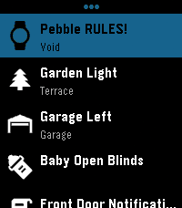
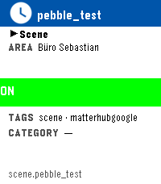
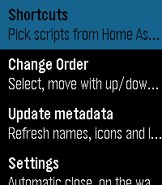

# pebble-ha-launcher

One-tap Home Assistant scripts and scenes from your wrist. Stored shortcuts
launch instantly; setup auto-fetches your scripts and scenes from HA.
Per-shortcut confirmation prevents accidental triggers; touch-ready;
auto-close for a fast-launch style. Scripts and scenes do whatever HA can.
Inspired by
[home-assistant-shortcuts](https://github.com/Carles-Figuerola/home-assistant-shortcuts),
rebuilt for the newest SDKs. Built with AI, maintained with love.





## Features

- **Fast by design** — your shortcuts live on the watch; launching sends one
  request to HA, no browsing, no config round-trips
- **Easy setup** — the picker fetches every available HA script and scene
  (name, area, tags, icon) automatically; pick the ones you use
- **Type at a glance** — the main list leads each shortcut's detail line with
  a symbol: `$` for scripts, a play triangle for scenes, then
  `·`-joined area, tags and icon category. The "Info line" sub-menu setting
  cycles which fields show (None / T·A·Tg·C / T·A·Tg / T·A / A·Tg·C /
  T·Tg·C)
- **Per-shortcut confirmation** — each shortcut is OFF, ON (runs directly) or
  CONFIRM (asks before running); grey / green / orange states in the picker
- **Touch-ready** — native touch navigation, opt-in from the phone settings
  (off by default until the firmware touch bugs are fixed)
- **Auto-close** — set Never/3s/5s/10s/15s/30s on the watch; idle time on the
  main screen returns you to the watchface, quick-launch style
- **Anything HA can do** — scripts and scenes can orchestrate lights, locks,
  media, notifications, integrations… one tap away

## Setup

1. Install the app on your watch.
2. In the Pebble app -> HA Launcher settings: enter your Home Assistant URL
   (e.g. `http://192.168.178.55:8123`) and your long-lived access token. The
   watch flashes "Settings saved" and stores the config durably in its own
   flash — the phone's storage is only a prefill cache.
3. On the watch: open the app, select "Edit shortcuts" (top entry). Every
   script and scene row shows its state — grey `OFF` (not in the launcher),
   green `ON` (runs directly), orange `CONFIRM` (asks before running) — plus
   a four-region classification table: banner, Type/Area split, state band,
   Tags (one per row)/Category split, with bold captions and `—` for empty
   values; the full entity id as footer.
   Press Select to cycle the state, then run the picked shortcuts from the
   main list. The 3-dot entry row also holds Change Order, Update metadata,
   Automatic close (SELECT cycles Never/3s/5s/10s/15s/30s) and Info line
   (SELECT cycles the main-screen detail fields). Missing entities stay
   listed in the picker with a red `!` so you can turn them off.

## Build

Requires the Pebble SDK (v4.17+ for touch support):

```bash
pebble build
```

## Credits

- Inspired by [home-assistant-shortcuts](https://github.com/Carles-Figuerola/home-assistant-shortcuts)
- Icon glyphs from Material Design Icons (https://materialdesignicons.com),
  Apache License 2.0
- **Fair notice: built with AI, maintained with love** — this is an
  independent, original implementation, not derived from other Home Assistant
  Pebble apps

## License

MIT.
